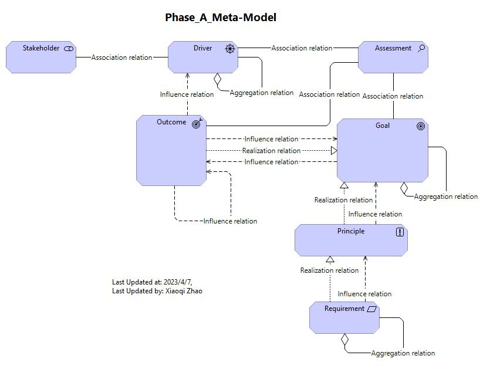

# Phase A: Architecture Vision

Figure 3: Fragment of a Stakeholder View: 

- [Archi_Model_03](./Phase_A_Architecture_Vision/03_Fragement_of_a_Stakeholder_View.archimate)
- [Video03_Link](https://youtu.be/fu9ggwU7d4g)
- 

Figure 4: Business Goals Associated with the Driver Profitability:

- [Archi_Model_04](./Phase_A_Architecture_Vision/04_Business_Goals_associated_with_Goal.archimate)
- [Video04_link](https://youtu.be/VbRfkwKFORY)
- 

- [Archi_Model_04 with v3.1](./Phase_A_Architecture_Vision/04_Business_Goals_associated_with_Goal-v3.1.archimate)
- [Video04 v3.1 Link](https://youtu.be/KWDpTVOi2HU)
- 

Figure 5: Principles View (Fragment)

- [Archi_Model_05](./Phase_A_Architecture_Vision/05_Principles_View.archimate)
- [Vidoe05_link](https://youtu.be/cAXccd-TrYs)
- 

Figure 6: Goal Refinement View for Rationalization Strategy

- [Archi_Model_06](./Phase_A_Architecture_Vision/06_Goal_Refinement.archimate)
- [Video06_link](https://youtu.be/G2w-xpTHmOw)
- 

Phase A: Meta Model Summary So Far

- [Archi_MetaModel for Phase A So Far](./Phase_A_Architecture_Vision/PhaseA_Metamodel.archimate)
- [Video-Build-Meta-Model](https://youtu.be/v0YQ7INVmo0)
- 

Figure 7: Strategy View for Digital Customer Intimacy Strategy

- [Archi_Model_07](./Phase_A_Architecture_Vision/07_LongTermStrategy.archimate)
- [Video-Long-Term-Strategy](https://youtu.be/6FdtyHRMttw)
- 

- [Archi_Model-07_without-Junction](./Phase_A_Architecture_Vision/07%20Strategy%20View%20-%20Long%20Term-withoutJunction.jpg)
- [Video About Junction Relation](https://youtu.be/KJ5kl8YbLbY)
- 

Figure 8: Solution Concept View

- [Archi_Model_08](./Phase_A_Architecture_Vision/08_SolutionConceptView.archimate)
- [Solution_Concept_View](https://youtu.be/skUYGaJGhKQ)
- 

Phase A: Meta-Model Updates

- [Modeling Pattern model file](./TOGAF_ADM_Modeling-Pattern_MetaModel.archimate)
- [TOGAF ADM Phase A Meta-Model (Modeling Pattern)](https://youtu.be/IndW2ooYEP8)
- 

---
### Here is Phase A: [Finished Model](./Phase_A_Architecture_Vision/PhaseA_Finished.archimate)

---

Completed at 2023-04-16