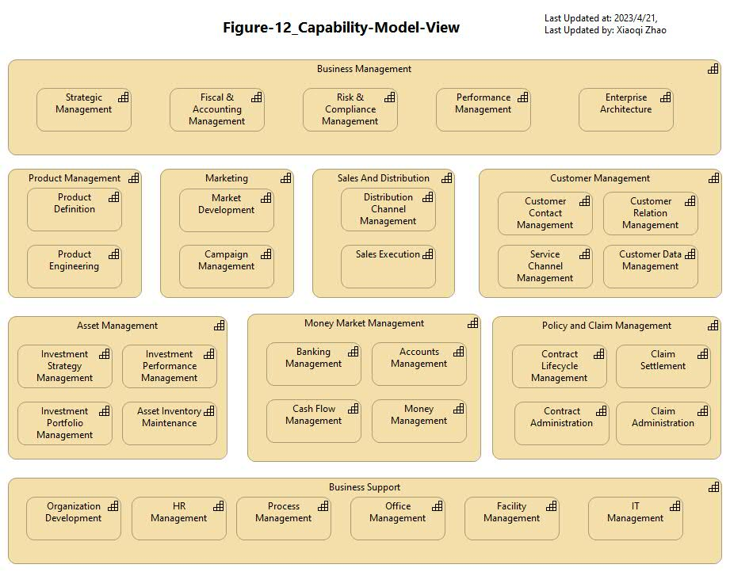
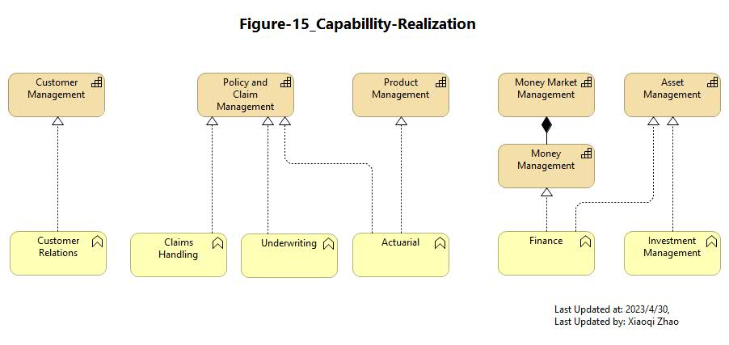
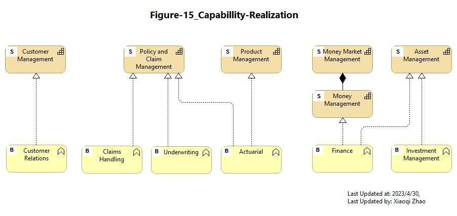
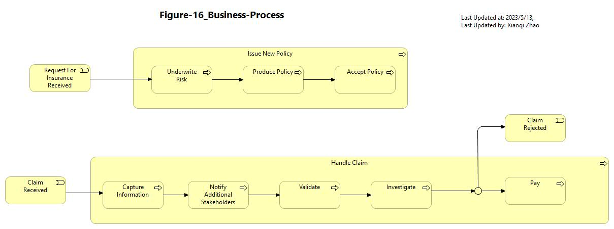
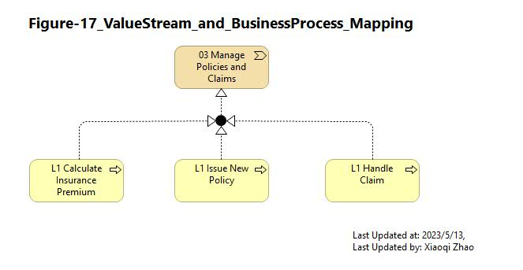

# Phase B: Business Architecture

## Figure 09 & 10: Organization View

- [Archi_Model_09~10](./Phase_B_Business_Architecture/09-and-10-Organization-View.archimate)
- [Figure 09 ~ 10 Video](https://youtu.be/ZWa8cWsqXtU)
- 
- .jpg)

---

## Figure 11: Value Stream

- [Archi_Model_11](./Phase_B_Business_Architecture/11-Value-Stream.archimate)
- [Figure 11 Video](https://youtu.be/HAMPkA0N84E)
- 

---

## Figure 12: Capability Model

- [Archi_Model_12](./Phase_B_Business_Architecture/12-Capability-Model.archimate)
- [Figure 12 Video](https://youtu.be/bZFEjAW1_XI)
- 

---

## Figure 13: Value Stream and Capability Cross-Mapping

- [Archi_Model_13](./Phase_B_Business_Architecture/13-ValuaStream-Capability-Mapping.archimate)
- [Figure 13 Video](https://youtu.be/kWLUo0TvYv0)
- 

---

## Figure 14: Business Function View (Baseline)

- [Archi_Model_14](./Phase_B_Business_Architecture/14-Business-Function(Baseline).archimate)
- [Figure 14 Video](https://youtu.be/mwkUkHeiD9g)
- .jpg)

---

## Figure 15: Capability Realization

- [Archi_Model_15](./Phase_B_Business_Architecture/15-Capability-Realization.archimate)
- [Figure 15 Video](https://youtu.be/d2EtlOFF_14)
- Without custom icon: 
- With custom icon: 
- [Video: How to add custom icon](https://youtu.be/EkjLObo5cpc)

---

## Figure 16: Business Process View

- [Archi_Model_16](./Phase_B_Business_Architecture/16-Business-Process.archimate)
- [Figure 16 Video - Pattern Update](https://youtu.be/OWBMCTl_cfw)
- [Figure 16 Video - Modeling](https://youtu.be/G7IvdEt3kw8)
- 

---

## Figure 17: Value Stream Relized by Business Process

- [Archi_Model_17](./Phase_B_Business_Architecture/17-ValueStream-BuzProcess.archimate)
- [Figure 17 Video](https://youtu.be/7oQWMSLtnWs)
- 

---

## Figure 18: Requirements Realization View