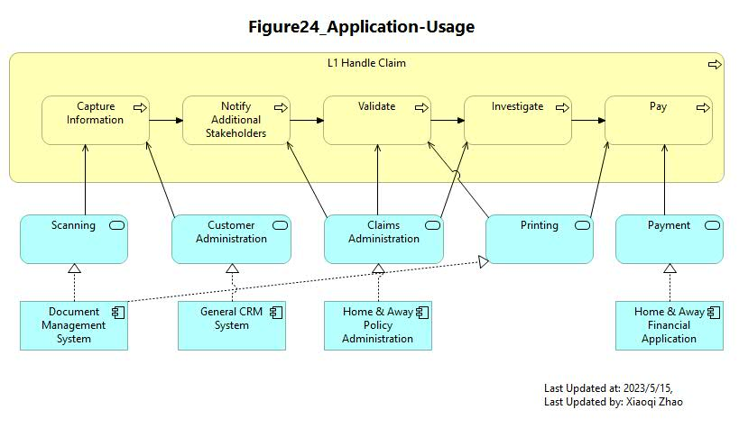
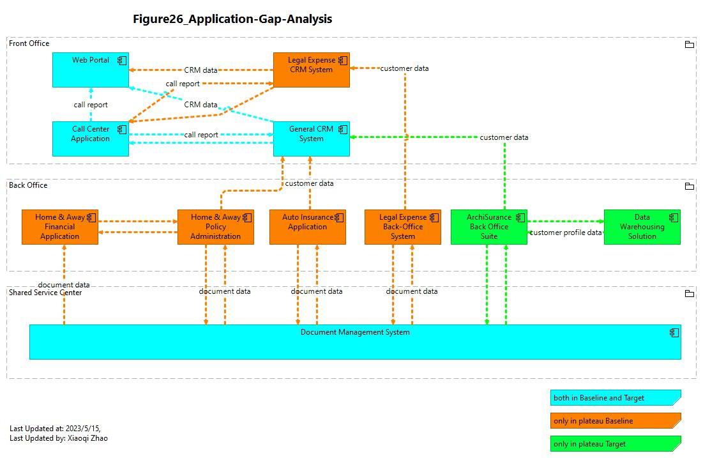

# Phase C: Information System Architecture

## Figure 22: Application Cooperation (Baseline)

- [Archi_Model_22](./Phase_C_IS_Architecture_Application/22-Application-Cooperation-Baseline.archimate)
- [Figure 22 Video](https://youtu.be/tDn6aAQz5Ho)
- .jpg)

---

## Figure 23: Application Cooperation (Target)

- [Archi_Model_23](./Phase_C_IS_Architecture_Application/23-Application-Cooperation-Target.archimate)
- [Figure 23 Video](https://youtu.be/3SuWjZdnCY0)
- .jpg)

---

## Figure 24: Application Usage (Baseline)

- [Archi_model_24](./Phase_C_IS_Architecture_Application/24-Application-Usage-Baseline.archimate)
- [Figure 24 Video](https://youtu.be/8kqIYG5_kl4)
- 

---

## Figure 25: Appliation Bahavior (Target)

- [Archi_model_25](./Phase_C_IS_Architecture_Application/25-Application-Behavior-Target.archimate)
- [Figure 25 Video](https://youtu.be/asHvBIgsFXY)
- .jpg)

---

## Figure 26: Application Architecture - Gap Analysis

- [Archi_model_26](./Phase_C_IS_Architecture_Application/26-Application-Gap-Analysis.archimate)
- [Figure 26 Video](https://youtu.be/_0jeka-293k)
- 

---

## Phase C1 Pattern Summary

---END of C1---