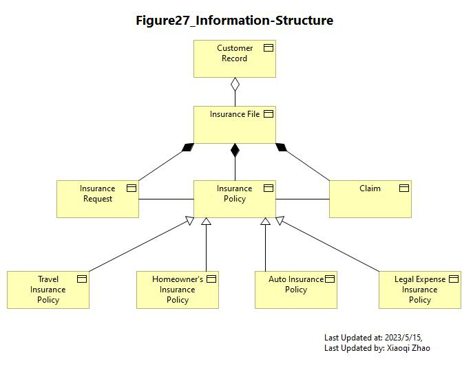
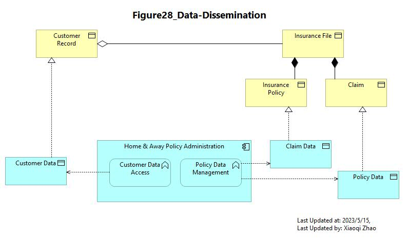

# Phase C2: Information Systems - Data Architecture

## Figure 27: Information Structure

- [Archi_Model_27](./Phase_C_IS_Architecture_Data/27-Information-Structure.archimate)
- [Figure 27 Video](https://youtu.be/kWNVbSURrG8)
- 

---

## Figure 28: Data Dissemination View

- [Archi_Model_28](./Phase_C_IS_Architecture_Data/28-Data-Dissemination.archimate)
- [Figure 28 Video](https://youtu.be/i6dZlCcW9mw)
- 

---
