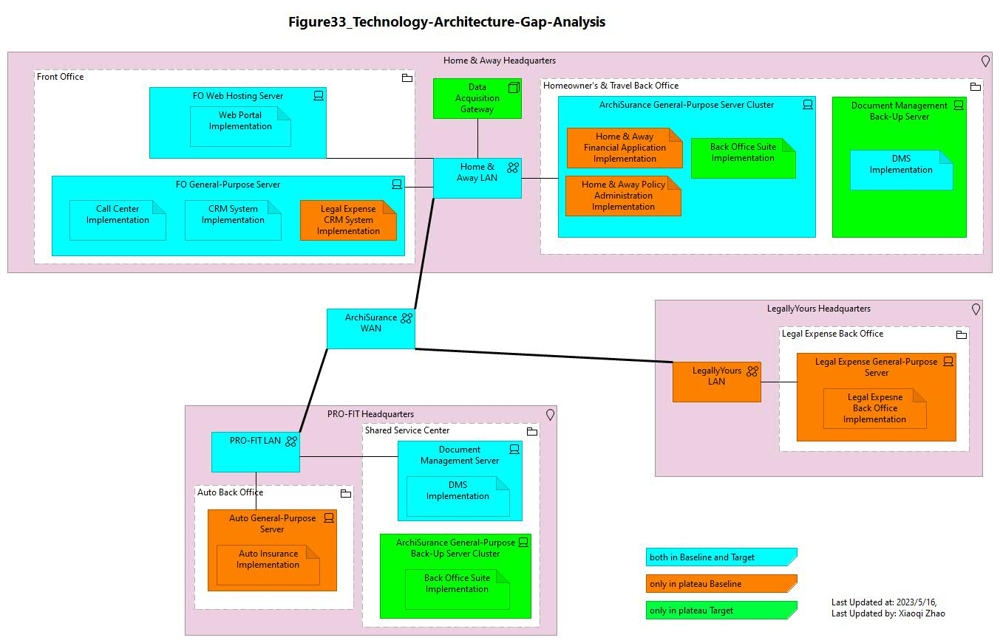

# Phase D: Technology Architecture

## Figure 29: Infrastructure View (Baseline)

- [Archi_Model_29](./Phase_D_Technology_Architecture/29-Infratructure-View-Baseline.archimate)
- [Figure 29 Video]()
- .jpg)

---

## Figure 30: Infrastructure View (Target)

- [Archi_Model_30](./Phase_D_Technology_Architecture/30-Infratructure-View-Target.archimate)
- [Figure 30 Video]()
- .jpg)

---

## Figure 31: Data Acquisition from IoT Services (Baseline)

- [Archi_Model_31](./Phase_D_Technology_Architecture/31-Data-Acquisition-Target.archimate)
- [Figure 31 Video]()
- .jpg)

---

## Figure 32: IoT Device Services (Target)

- [Archi_Model_32](./Phase_D_Technology_Architecture/32-IoT-Device-Services.archimate)
- [Figure 32 Video]()
- .jpg)

---

## Figure 33: Technology Architecture: Gap Analysis

- [Archi_Model_33](./Phase_D_Technology_Architecture/33-TechArch-Gap-Analysis.archimate)
- [Figure 33 Video]()
- 

---

## Phase D - Modeling Pattern

---END of Phase D---