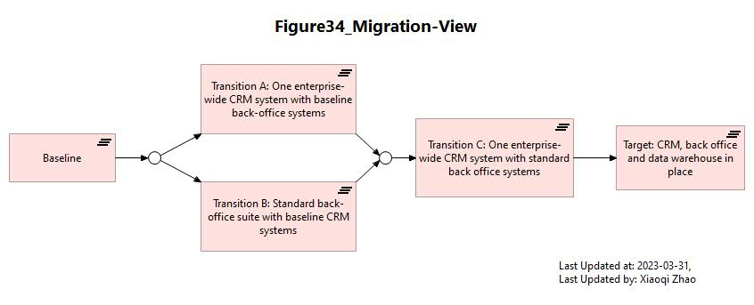
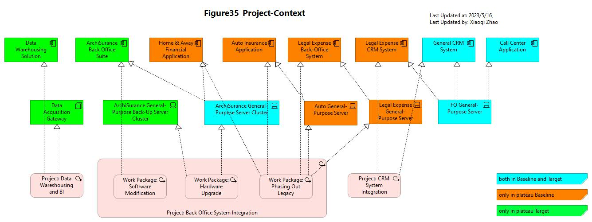

#  Phsae E & F: Opportunities & Solutions and Migration Planning

## Figure 34: Migration View

- [Archi_Model_34](./Phase_E_F_Oppotunities_Solution_and_Migration_Planning/34-Migration-View.archimate)
- [Figure 34 Video]()
- 

---

## Figure 35: TOGAF Project Context Diagram

- [Archi_Model_35](./Phase_E_F_Oppotunities_Solution_and_Migration_Planning/35-Project-Context.archimate)
- [Figure 35 Video]()
- 

---

## Phase E & F Modeling Pattern

